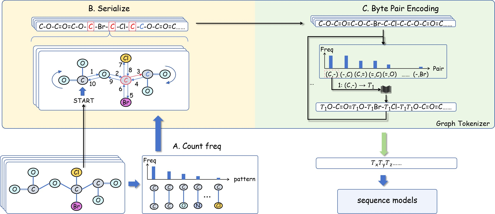

# GraphTokenizer

**Graph Tokenization for Bridging Graphs and Transformers**

[[中文文档 / Chinese README]](README_zh.md) · [[Paper (ICLR 2026)]](https://openreview.net/forum?id=PLACEHOLDER)

> **Branches:** `release` — clean code for reproducing paper experiments. [`dev`](../../tree/dev) — full development version with utility scripts, benchmarks, and internal docs.

## Overview

GraphTokenizer is a general framework for **graph tokenization** that converts arbitrary labeled graphs into discrete token sequences, enabling standard off-the-shelf Transformer models (e.g., BERT, GTE) to be applied directly to graph-structured data **without any architectural modifications**.

The framework combines **reversible graph serialization** with **Byte Pair Encoding (BPE)**, a widely adopted tokenizer in large language models. A structure-guided serialization mechanism uses global statistics of graph substructures to ensure that frequently occurring substructures appear as adjacent symbols in the sequence — an ideal input for BPE to learn a meaningful vocabulary of structural graph tokens.

<p align="center">
  
</p>

**Framework overview.** (A) Substructure frequencies are collected from training graphs. (B) Structure-guided reversible serialization via frequency-guided Eulerian circuit. (C) BPE vocabulary is trained on the serialized corpus, and graphs are encoded into discrete tokens for downstream sequence models.

```
Labeled Graphs → Structure-Guided Serialization → BPE Tokenization → Transformer → Predictions
```

### Key Contributions

- **General Graph Tokenization Framework.** Combines reversible serialization with BPE to create an interface between graphs and sequence models, enabling standard Transformers to process graph data without modifications.
- **Structure-Guided Serialization for BPE.** A deterministic serialization guided by global substructure statistics that addresses ordering ambiguities in graphs and aligns frequent substructures into adjacent patterns for BPE to merge.
- **State-of-the-Art on 14 Benchmarks.** Achieves SOTA results across diverse graph classification and regression benchmarks spanning molecular, biomedical, social, academic, and synthetic domains.

### Main Results

| Model | molhiv (AUC↑) | p-func (AP↑) | mutag (Acc↑) | coildel (Acc↑) | dblp (Acc↑) | qm9 (MAE↓) | zinc (MAE↓) | aqsol (MAE↓) | p-struct (MAE↓) |
|:---:|:---:|:---:|:---:|:---:|:---:|:---:|:---:|:---:|:---:|
| GCN | 74.0 | 53.2 | 79.7 | 74.6 | 76.6 | 0.134 | 0.399 | 1.345 | 0.342 |
| GIN | 76.1 | 61.4 | 80.4 | 72.0 | 73.8 | 0.176 | 0.379 | 2.053 | 0.338 |
| GatedGCN | 80.6 | 51.2 | 83.6 | 83.7 | 86.0 | 0.096 | 0.370 | 0.940 | 0.312 |
| GraphGPS | 78.5 | 53.5 | 84.3 | 80.5 | 71.6 | 0.084 | 0.310 | 1.587 | 0.251 |
| Exphormer | 82.3 | 64.5 | 82.7 | **91.5** | 84.9 | 0.080 | 0.281 | 0.749 | 0.251 |
| GraphMamba | 81.2 | 67.7 | 85.0 | 74.5 | 87.6 | 0.083 | 0.209 | 1.133 | 0.248 |
| GCN+ | 80.1 | 72.6 | 88.7 | 88.9 | 89.6 | 0.077 | **0.116** | 0.712 | 0.244 |
| **GT+BERT** | 82.6 | 68.5 | 87.5 | 74.1 | 93.2 | 0.122 | 0.241 | 0.648 | 0.247 |
| **GT+GTE** | **87.4** | **73.1** | **90.1** | 89.6 | **93.6** | **0.071** | 0.131 | **0.609** | **0.242** |

Results are mean over 5 runs. Bold = best. See the paper for full results on all 14 datasets.

## Project Structure

```
GraphTokenizer/
├── prepare_data_new.py         # Data preprocessing: serialization + BPE training + vocab
├── run_pretrain.py             # Pre-training entry point (MLM)
├── run_finetune.py             # Fine-tuning entry point (regression/classification)
├── batch_pretrain_simple.py    # Batch pre-training across datasets/methods/GPUs
├── batch_finetune_simple.py    # Batch fine-tuning
├── aggregate_results.py        # Collect and tabulate experiment results
├── config.py                   # Centralized configuration management
├── config/default_config.yml   # Default config values
├── src/
│   ├── algorithms/
│   │   ├── serializer/         # Graph serialization (Freq-Euler, Euler, DFS, BFS, Topo, SMILES, CPP, ...)
│   │   └── compression/        # BPE engine (C++ / Numba / Python backends)
│   ├── data/                   # Unified data interface and per-dataset loaders
│   │   └── loader/             # Per-dataset loaders (QM9, ZINC, AQSOL, MNIST, Peptides, ...)
│   ├── models/                 # Model definitions
│   │   ├── bert/               # BERT encoder, vocab manager, data pipeline
│   │   ├── gte/                # GTE encoder (Alibaba-NLP/gte-multilingual-base)
│   │   └── unified_encoder.py  # Unified encoder interface
│   ├── training/               # Training pipelines (pretrain, finetune, evaluation)
│   └── utils/                  # Logging, metrics, visualization
├── gte_model/                  # Local GTE model config (for offline use)
├── final/                      # Paper experiment scripts and plotting code
└── docs/                       # Documentation
```

## Installation

```bash
git clone https://github.com/BUPT-GAMMA/GraphTokenizer.git
cd GraphTokenizer

# Install in development mode
pip install -e .

# Build the C++ BPE backend (optional but recommended for speed)
python setup.py build_ext --inplace
```

Key dependencies: `torch`, `dgl`, `networkx`, `rdkit`, `transformers`, `pybind11`, `pandas`.

## Quick Start

### 1. Data Preparation

Serialize graphs and train a BPE tokenizer:

```bash
python prepare_data_new.py \
    --datasets qm9test \
    --methods feuler \
    --bpe_merges 2000
```

This loads the dataset, serializes all graphs with the chosen method (e.g., frequency-guided Eulerian circuit), trains a BPE model on the resulting sequences, and builds a vocabulary. All artifacts are cached for reuse.

### 2. Pre-training

Pre-train a Transformer encoder with Masked Language Modeling (MLM):

```bash
python run_pretrain.py \
    --dataset qm9test \
    --method feuler \
    --experiment_group my_experiment \
    --epochs 100 \
    --batch_size 256
```

### 3. Fine-tuning

Fine-tune the pre-trained model on downstream graph prediction tasks:

```bash
python run_finetune.py \
    --dataset qm9test \
    --method feuler \
    --experiment_group my_experiment \
    --target_property homo \
    --epochs 200 \
    --batch_size 64
```

### 4. Batch Experiments

Run experiments across multiple datasets, serialization methods, and GPUs in parallel:

```bash
python batch_pretrain_simple.py \
    --datasets qm9,zinc,mutagenicity \
    --methods feuler,eulerian,cpp \
    --bpe_scenarios all,raw \
    --gpus 0,1

python batch_finetune_simple.py \
    --datasets qm9,zinc,mutagenicity \
    --methods feuler,eulerian,cpp \
    --bpe_scenarios all,raw \
    --gpus 0,1
```

## Reproducing Paper Experiments

Scripts for all paper experiments are in the `final/` directory:

- **Main experiments** — `final/exp1_main/run/`: pre-training and fine-tuning commands for all 14 datasets
- **Efficiency analysis** — `final/exp1_speed/`: serialization speed, token length stats, training throughput
- **Multi-sampling comparison** — `final/exp2_mult_seralize_comp/`: effect of multiple serialization samples
- **BPE vocabulary visualization** — `final/exp4_bpe_vocab_visual/`: codebook inspection and visualization

## Documentation

- [Configuration Guide](docs/guides/config_guide.md) — config file structure and parameters
- [Experiment Guide](docs/guides/experiment_guide.md) — how to design and run experiments
- [BPE Usage Guide](docs/bpe/BPE_USAGE_GUIDE.md) — BPE engine API and usage

## Citation

If you find this work useful, please cite our paper:

```bibtex
@inproceedings{guo2026graphtokenizer,
  title={Graph Tokenization for Bridging Graphs and Transformers},
  author={Guo, Zeyuan and Diao, Enmao and Yang, Cheng and Shi, Chuan},
  booktitle={International Conference on Learning Representations (ICLR)},
  year={2026}
}
```

## Branches

- **`release`** — Clean version with only the code needed to reproduce paper experiments.
- **`dev`** — Full development version with all utility scripts, benchmarks, and internal documentation.
