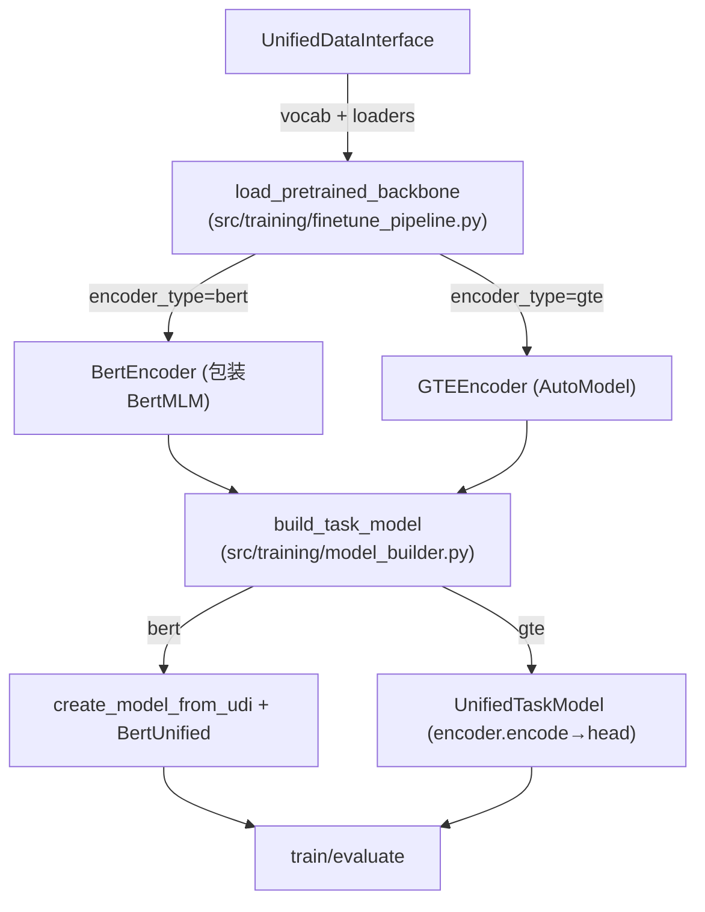

# GTE 微调集成文档（对齐现有流程）

## 1. 设计理念与边界
- **Encoder即黑盒**：输入 token id 序列 + attention_mask，输出句向量（sequence → vector）。
- **主流程不改**：由现有 `create_model_from_udi + TaskHandler` 负责任务头、损失、指标与评估。
- **抽象屏蔽差异**：BERT 与 GTE 均实现统一抽象接口，配置差异封装在各自实现内部。
- **面向全体数据集**：遵循 UDI 统一格式，支持项目内 14 个数据集，不限于分子图。

## 2. 现有流程与对接点



- Backbone 提供“编码能力”；
- 任务模型与训练/评估流程保持原状；
- 我们只在“Backbone位置”替换为抽象 encoder 实现（BERT 或 GTE）。

### 2.1 端到端数据契约（来自 UDI）
- 输入给 encoder 的张量：
  - input_ids: Long[int64]，形状 [batch_size, seq_len]；
  - attention_mask: Long/Float，形状 [batch_size, seq_len]；1 有效、0 padding；
- 序列长度：遵循 config 中 effective max length（不会超过模型上限）；
- pad id：由 `VocabManager` 决定，保证与 attention_mask 一致；
- encoder 输出：句向量 [batch_size, hidden_size]，供任务头使用。

## 3. 统一抽象与实现

- 文件：`src/models/unified_encoder.py`
  - `BaseEncoder`: 统一接口，定义 `encode(input_ids, attention_mask, pooling_method) -> [B, H]` 与 `get_hidden_size()`。
  - `BertEncoder`: 包装项目内置 BERT（`create_bert_mlm`），内部用 `BertModel` 得到 `[B, L, H]` 后按 `attention_mask` 做 mean/cls 池化。
  - `GTEEncoder`: 加载 `Alibaba-NLP/gte-multilingual-base`（trust_remote_code），内部直接返回句向量（已由模型实现池化/投影）。
  - `create_encoder`: 工厂方法，按 `model_name/encoder_type` 选择 BERT 或 GTE。
  - `UnifiedTaskModel`: 通用任务头（线性层），用于 GTE 情况下的快速包装（与现有 `TaskHandler` 协同）。

注意：
- `BertEncoder` 与现有 BERT 完全兼容，不改变任何上层调用方式；
- `GTEEncoder` 封装了 unpadding/memory-efficient attention 等配置，避免污染主流程；
- 以上仅作为“微调阶段”的 encoder；预训练阶段单独占位，见第 6 节。

### 3.1 池化策略与一致性
- BertEncoder：内部从 `BertModel` 获取 `last_hidden_state`（[B, L, H]），按 `attention_mask` 做 mean/cls 池化；
- GTEEncoder：底层模型即返回句向量（[B, H]），与 BertEncoder 池化后的输出对齐；
- 对上层而言，两者均提供“句向量”，Hidden size 见下：
  - BERT（默认 small）：H=512；
  - GTE（multilingual-base）：H=768。

## 4. 微调集成步骤（不改主流程）

1) 选择 encoder 类型
- 在配置中设置（示例）：
```yaml
# config/default_config.yml（或 args 覆盖）
encoder_type: bert  # 可切换为 gte
```

2) 加载 backbone（仅替换返回对象为抽象 encoder）
- `src/training/finetune_pipeline.py` 内部：
  - 当 `encoder_type=bert`：调用现有 `_load_bert_backbone`，随后包装为 `BertEncoder` 返回；
  - 当 `encoder_type=gte`：通过 UDI 获取 `vocab_manager`，调用 `create_encoder('gte', config, vocab_manager)` 返回 `GTEEncoder`；

3) 构建任务模型（保持原状）
- `build_task_model(...)` 内：
  - `encoder_type=bert`：沿用 `create_model_from_udi(udi, pretrained_bert, pooling)` → `BertUnified + TaskHandler`；
  - `encoder_type=gte`：使用 `UnifiedTaskModel(encoder=GTEEncoder, task_type, output_dim)` 与 `TaskHandler`；

4) 训练与评估
- 原训练/评估脚本无需改动，按既有流程执行；
- 适用于所有已接入数据集（14 个数据集）。

### 4.1 端到端检查清单
- 形状与 dtype：input_ids[Long][B, L]、attention_mask[Long/Float][B, L]、输出向量[Float][B, H]；
- 设备一致性：encoder 与 batch 张量同设备（CPU/GPU）；
- 混合精度：GTEEncoder 默认可用 float16；BERT 可根据训练策略选择 AMP；
- 多数据集：不依赖数据集特性，仅依赖 token ids/attention mask；
- 失败快（fail-fast）：若维度、mask 不匹配，抛出异常。

## 5. 配置要点（GTE）

- 由 `GTEEncoder` 内部处理与吸收：
  - `unpad_inputs: true`
  - `use_memory_efficient_attention: true`
  - `torch_dtype: float16`（可按环境/显存调整）
- 可在配置中添加可选块（仅供 encoder 内部读取，不影响主流程）：
```yaml
gte:
  optimization:
    unpad_inputs: true
    use_memory_efficient_attention: true
    torch_dtype: "float16"
```

### 5.1 常见问题与约束
- 若无 xformers，`use_memory_efficient_attention` 可设为 false；
- 若显存紧张，保持 `unpad_inputs: true` 能显著节省内存；
- GTE 最大序列长度通常为 8192，上层仍应遵循项目的有效长度策略；
- 当前微调阶段不支持 token 级“额外特征融合”，统一以 token ids 作为输入。

## 6. 预训练（占位说明，待确认）

目标：在保持分层与职责边界的前提下，若未来需要基于 GTE 做预训练：
- 方案方向 A：以 GTE 为 backbone，重置参数，映射/适配层命名与权重结构，复用现有预训练任务（如 MLM 变体），保持 `create_model_from_udi` 与 `TaskHandler` 接口不变；
- 方案方向 B：实现“GTE 风格 Backbone”的兼容层（保留 unpadding/xformers/rope 等优化），使之在 `BertUnified` 位置可替换；
- 待确认清单：
  - 是否沿用现有 vocab / `VocabManager`，以及是否替换 GTE 的 embedding；
  - 预训练任务的定义（仅 MLM 或加入对比学习/多任务）；
  - 权重初始化策略与训练脚本的最小改动边界；

（此节为占位，等明确设计约束后，再补充具体层级映射、训练入口与最小改动清单。）

## 7. 验证与回归
- 回归测试：
  - `encoder_type=bert` 下结果与现有基线一致；
  - `encoder_type=gte` 在多数据集（不止分子图）上跑通端到端流程；
- 性能观测：
  - 训练/推理速度、显存占用（unpadding/xformers 应可见优化）；
  - 任务指标（准确率/MAE等）与基线对比。

## 8. 关键点回顾
- 不改主流程，仅在 backbone 处用抽象 encoder 替换；
- BERT 与 GTE 都是 `sequence→vector` 的实现；
- 任务逻辑交由 `TaskHandler` 与现有模型构建负责；
- 面向 14 个数据集，遵循 UDI 统一输入格式；
- 预训练部分待需求确认后逐步细化，保持占位可扩展。

## 9. 附：最小变更对照（仅供参考，不强制）
- `load_pretrained_backbone`：按 `encoder_type` 返回 `BertEncoder` 或 `GTEEncoder`；
- `build_task_model`：
  - bert 分支：维持 `create_model_from_udi(udi, pretrained_bert, pooling)`；
  - gte 分支：`UnifiedTaskModel(encoder=GTEEncoder, task_type, output_dim)`；
- 其它模块无改动。
